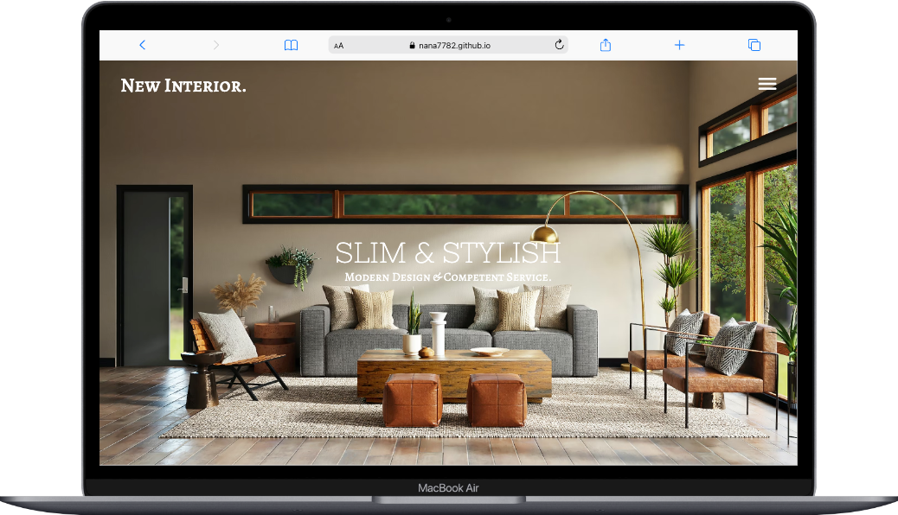

<a id="readme-top"></a>

<br />
<div align="center">

<h3 align="center">New Interior.</h3>

  <p align="center">
    This is my final project of Modul 1 - WebDev Bootcamp by <a href="https://www.super-code.de">Supercode</a>
    <br />
    <a href="https://github.com/Nana7782/Abschlussprojekt-Modul-1_New-Interior"><strong>Gp to my Repo »</strong></a>
    <br />
    <br />
    <a href="https://nana7782.github.io/Abschlussprojekt-Modul-1_New-Interior/">View in browser</a>
  </p>
</div>

<details>
  <summary>Table of Contents</summary>
  <ol>
    <li>
      <a href="#about-the-project">About The Project</a>
      <ul>
        <li><a href="#built-with">Built With</a></li>
      </ul>
    </li>
    <li>
      <a href="#getting-started">Getting Started</a>
      <ul>
        <li><a href="#installation">Installation</a></li>
      </ul>
    </li>
    <li><a href="#contact">Contact</a></li>
  </ol>
</details>

## About The Project



<p>This final project is about implementing the skills learnt in HTML & CSS.</p>
<p>
For this purpose, a given design is to be realised. The design files, including images and fonts, were provided in a Figma file containing three views of the project: Desktop, Tablet and Mobile view. (1440px, 768px, 375px)</p>
<p>
I decided to implement the project in SASS, also to get more practice with SASS, since we only briefly touched this topic. </br>
So it took a little more time, but I've learnt a lot from it.</p>
<p>There are some cool hover & zoom-effects and some sections with a parallax.</p>

<p align="right">(<a href="#readme-top">back to top</a>)</p>

### Built With

HTML & SASS

<p align="right">(<a href="#readme-top">back to top</a>)</p>

## Getting Started

<p>This is a one-page-website with no functional elements.</br>
Of course you can klick on the links, but they will just lead you back to top.</p>

### Installation

To clone the repo:

```sh
git clone git@github.com:Nana7782/Abschlussprojekt-Modul-1_New-Interior.git
```

<p align="right">(<a href="#readme-top">back to top</a>)</p>

## Contact

Nana Leven - nana.leven@mail.de

Project Link: [https://nana7782.github.io/Abschlussprojekt-Modul-1_New-Interior/](https://nana7782.github.io/Abschlussprojekt-Modul-1_New-Interior/)

<p align="right">(<a href="#readme-top">back to top</a>)</p>

<p style="font-size: 30px; text-align:center;">Thanks for stopping by :) </p>
